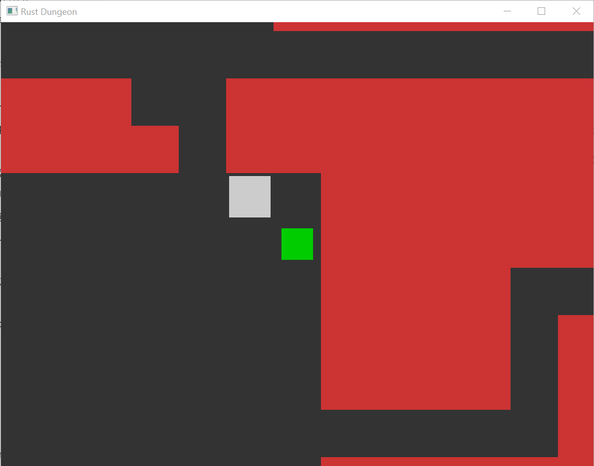
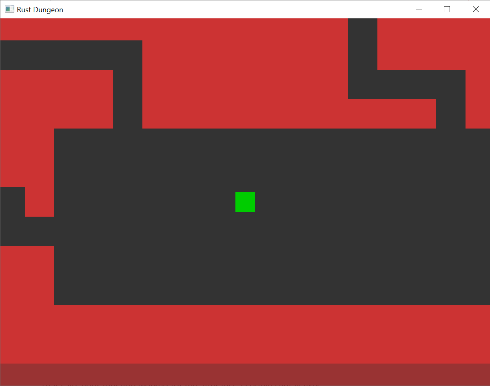
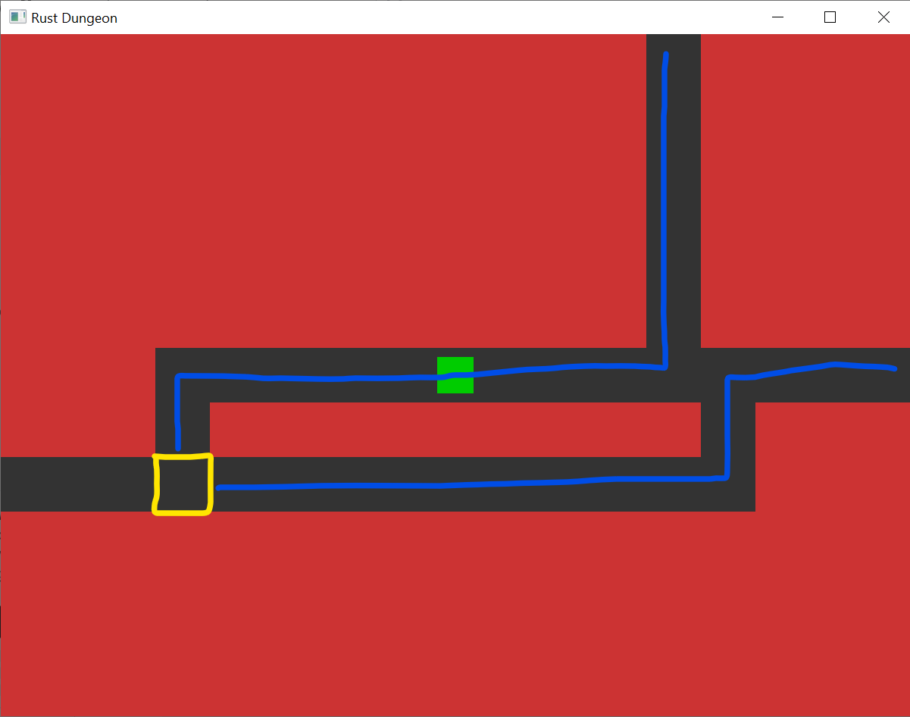
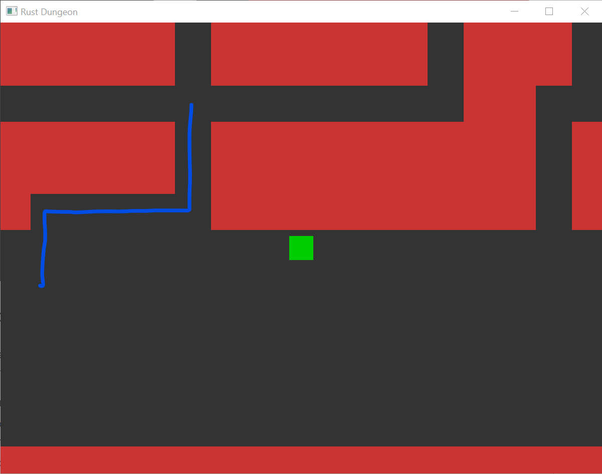

# Rust Dungeon
A simple mystery dungeon style map generator, using Rust and more specifically [Bevy](https://github.com/bevyengine/bevy).

## Mystery Dungeon?
Most popularly associated with the Pokemon Mystery Dungeon series, a Mystery Dungeon (proper noun) is a series of roguelike games developed by Spike Chunsoft, sometimes in collaboration with other IPs. However, the genre of mystery dungeon games inspired by the formula extends well beyond the reach of copyright.

The basic gameplay is eight-directional grid-based movement through randomly generated maps, populated by enemies and items. Player and enemies alike move in turns, with enemies only acting after the player makes a move. These games generally have a strong emphasis on positioning, as players may have to decide on movements based on enemy dangers such as ranged attacks or being surrounded.

## How to Play
Use the arrow keys to move the green square through the maze. The goal is to find the white 'exit' tile. When on top of the exit, press the spacebar to enter the next map.

## How It Works
Although the **References Used** section contains a more in depth explanation and additional functionality not currently implemented in my code, the basic idea of the algorithm is:
1. Divide the map space into *M* columns and *N* rows to make *M* x *N* sectors
2. Draw a randomly sized and positioned rectangle within each sector, creating a rectangular room that remains in the bounds of the sector
3. Randomly connect adjacent sectors' rooms with hallways, ensuring that the map is fully connected (there is always a path from any room to any other room)

## Refinements
Following the above steps will result in dungeons that are a bit too gridlike without enough variation.

### Dummy Rooms
Instead of creating a rectangular room in every sector, some sectors can instead use a 'dummy room', a 1x1 room that doesn't necessarily have to be connected to a room unless it is part of the path needed to connect two other rooms. A hallway that leads to a dummy room can then branch off in other directions, increasing the complexity of the map from simply connecting two adjacent rooms with a path.

Below is a demonstration. The two tiles outlined in yellow are 1x1 dummy rooms, creating a bend on the bottom and a three-way junction on top.

### Hallway Generation
A single straight line connecting two rooms is not very elegant and sometime impossible depending on the positioning, so instead hallways are extended outwards from the closest parallel edge of each room, then linked at some random midpoint between the two. This creates a more 'jagged' connection between rooms, dummy or otherwise.

### Room Merging
When two rooms are in adjacent sectors and supposed to be linked by a hallway, the algorithm can instead merge them together into one larger room. This preserves the original hallways leading out of both of the original rooms, but obfuscates the grid pattern of sectors more, creating a larger room on the map with multiple possible exits in the same direction.

## Current Issues
The algorithm is missing several sanity checks, such as sector size vs minimum room size. There are also some quirks with hallway generation, since there are no checks to make sure hallways don't collide.

Although the most recent version makes sure hallways have a 1-tile buffer zone from the edges of rooms, dummy rooms can still have hallways intersect or run alongside each other, and the buffer zone does not take room merges into account that could extend the original room beyond the buffer zone. In the following images, the intended hallway is traced in blue.

### References Used
- TheZZAZZGlitch's video on Pokemon Mystery Dungeon's generation algorithms:
https://www.youtube.com/watch?v=fudOO713qYo